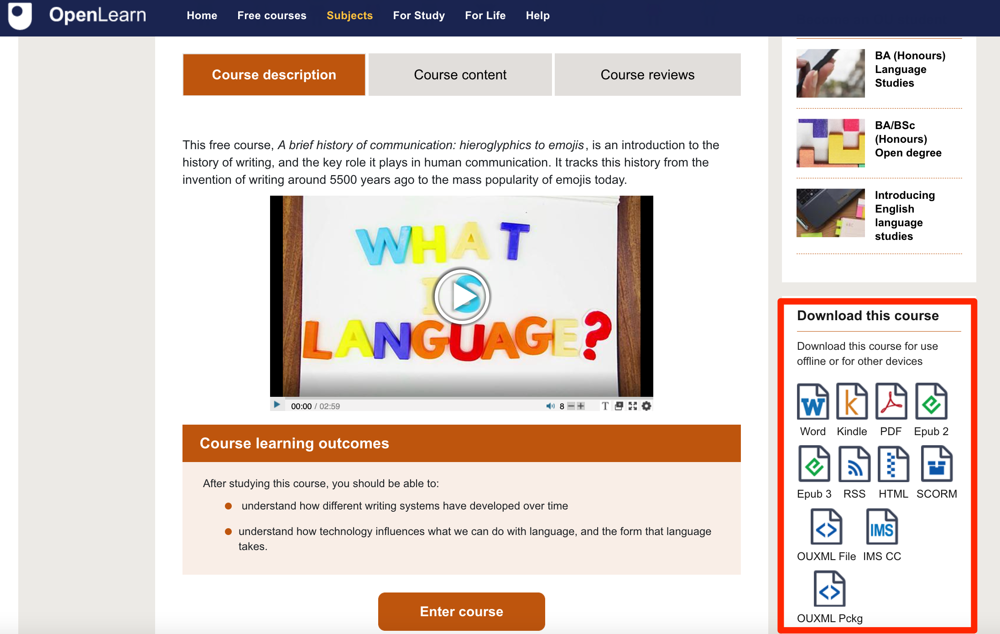

# A Quick Overview of OU-XML

OU-XML is an XML based structured document format that is used to represent "gold master" teaching material documents. OU-XML source documents can be rendered to a wide variety of output formats, including HTML web pages, PDF documents, and e-books.

OU-XML uses the notion of "tags", much as are used in HTML documents, to add semantics to document content. For example, we might mark-up a glossary item in the following tag structured way:

```xml
<GlossaryItem>
    <Term>Computer program</Term>
    <Definition>The list of instructions the computer follows to process input and produce output.</Definition>
</GlossaryItem>
```

The structured format provides a means of identifying different *structural* (or "semantic") elements within a set of teaching materials. Whilst the different elements may be rendered in different ways, the presentational differences follow from the structure: headings are not large font, bold items; headings are rendered using large, strongly emphasised fonts *because* they are headings and that is how we choose to distinguish headings from other content elements.


For example, we might rendered a structured element in a such a way that communicates some difference regarding the semantics:

__Computer program:__ *The list of instructions the computer follows to process input and produce output.*

One important thing to realise is that the presentational differences are *not* the primary reason for using structured markup. The structure is there to add meaning to the content. Designers can then use presentational tricks and devices to help communicate the explicitly represented meaning in a visually meaningful way, for example, but there may also be other, potentially even more valuable, ways of using content based on the meaning we have asscociated with it through structured markup.

A wide variety of structural element types are defined as part of the OU-XML schema. This includes tags that can be used to identify simple "atomic" elements such as learning objectives, simple compound elements such as glossary items (which include a *term* and a *definition*) and more complex elements such as activities, SAQs and ITQs, media items. As well as these "micro-curriculum assets", the structured document format also supports the arrangement and grouping of content within elements as such as units, sections and subsections etc.

*(OU internal readers can see a full list of the available tags from the [Structured Content Tag Guide](https://learn3.open.ac.uk/mod/oucontent/view.php?id=185747&section=3).)*

For the majority of study units published on OpenLearn, the "source" material is a structured OU-XML document. Where an OU-XML source document *is* available, it is typically also made available for download, along with other renderd formats of the same content.



*Note that the OU-XML document __does not__ contain media assets such as images or videos. Instead, these are linked to elsewhere. In contrast, PDF rendered documents do include images, for example, and the HTML download provided for many units on the OpenLearn site does include image and video assets as part of the zip archive file used to distribute the HTML download.*

<!-- #region -->
## OU-XML Documents as Micro-Curriculum Asset Databases


way of thinking about a single XML document such as an OU-XML is as a 

search for and retrieve
prncipled way
<!-- #endregion -->
